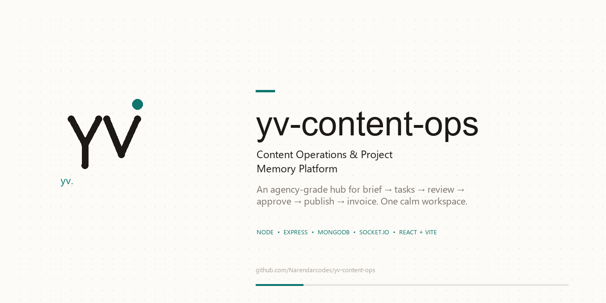

# yv. — content ops

> **yv-content-ops** — Content Operations & Project Memory Platform

The backend + frontend for the **yv. Content Operations & Project Memory Platform** — an agency-grade hub to take content from **idea → brief → tasks → review → approval → publish → invoice**, with full project memory, chat, and client workflows.

Built under the **yv.** brand. Monorepo: Node.js + Express + MongoDB API and a React + Vite frontend.

<p>
  
  &nbsp;
  
</p>

[](#tech-stack)
[](#tech-stack)
[](#tech-stack)
[](#license)



---

## Table of contents

- [What this is](#what-this-is)
- [Features](#features)
- [Tech stack](#tech-stack)
- [Project layout](#project-layout)
- [Quickstart](#quickstart)
- [Docker](#docker)
- [Configuration](#configuration)
- [API](#api)
- [Project lifecycle](#project-lifecycle)
- [Roles & permissions](#roles--permissions)
- [Tests](#tests)
- [Feature coverage vs Fluit](#feature-coverage-vs-fluit)
- [Status & roadmap](#status--roadmap)

---

## What this is

**yv-content-ops** powers the content operations loop for agencies and in-house teams:

- **Projects** with a strict lifecycle state machine, versioning, inputs, comments, revisions, approvals, scheduling, publication and performance metrics.
- **Tasks** (kanban), **Briefs**, **Review locking & summarization**, **Chat** (channels + threads), **Contracts** and **Invoices** — the Fluit-aligned agency surface.
- **Org-scoped RBAC**, JWT auth with hashed refresh tokens, notifications, activity history, file uploads, and a pluggable storage adapter.

Product spec: see the PRD PDF in the repo root.

---

## Features

**MVP (PRD)**
- JWT auth (access + refresh), org-scoped roles & permissions
- Project lifecycle state machine, versioning, inputs, comments, revisions, approvals
- Scheduling / publication, performance metrics, file uploads, activity history, notifications
- Docker + CI

**Agency operations (Fluit-aligned)**
- **Tasks** — kanban `todo → in_progress → in_review → done`, assignees, priority, due dates, notifications
- **Brief** — structured creative brief (goal, audience, references, deliverables, deadlines, brand files)
- **Review** — `summarize` unresolved feedback into action items + `lock` feedback into next revision scope
- **Chat** — channels/DMs, threaded messages, attachments, notifications, Socket.IO realtime
- **Contracts** — `draft → sent → viewed → signed` with captured signer identity
- **Invoices** — `draft → sent → paid/void`, net-30 due dates, overdue detection, outstanding revenue query

---

## Tech stack

| Layer | Stack |
|---|---|
| **Runtime** | Node.js 24 (CommonJS), Express 4 |
| **Database** | MongoDB 7 + Mongoose 7 (`mongodb-memory-server` for tests) |
| **Auth** | `bcryptjs` + JWT access tokens, SHA-256 hashed refresh tokens in DB |
| **Validation** | Joi schemas + middleware |
| **Infra** | pino, helmet, morgan, express-rate-limit, CORS, multer (memory) → storage adapter |
| **Realtime** | Socket.IO 4 |
| **Testing** | Jest + Supertest |
| **Frontend** | React 18 + Vite 5 + TypeScript, Tailwind CSS 4, React Router 6, TanStack Query 5, Three.js + GSAP + Lenis |

---

## Project layout

```
yv-content-ops/
├── src/                 # API — Express app
│   ├── config/          # env / config
│   ├── controllers/     # HTTP handlers
│   ├── db/              # mongoose connection
│   ├── events/          # domain event bus (activity, notifications)
│   ├── middleware/      # auth, validation, errors
│   ├── models/          # mongoose models
│   ├── realtime/        # Socket.IO (src/realtime/socket.js)
│   ├── routes/          # express routers
│   ├── seed/            # default roles
│   ├── services/        # business logic
│   ├── storage/         # file storage adapter (local)
│   ├── utils/           # tokens, logger
│   └── validators/      # Joi schemas
├── frontend/            # Web app — Vite + React
│   └── src/
│       ├── components/  # primitives, landing (HeroTunnel, GalleryTunnel, etc.)
│       ├── layouts/     # AppShell
│       ├── lib/         # api, auth, roles, landing/motion
│       ├── pages/       # Dashboard, Projects, Board, Chat, Review, Concepts, etc.
│       └── services/
├── docs/
│   └── openapi.yaml     # OpenAPI 3.1 spec
├── tests/               # Jest + Supertest (in-memory MongoDB)
├── scripts/             # seed-chat.js etc.
├── yv_svgs/             # yv. brand — yv-mark.svg, yv-wordmark.svg, yv-favicon.svg
├── docker-compose.yml
├── Dockerfile
└── README.md
```

---

## Quickstart

### Prerequisites

- Node.js 24+, npm
- MongoDB 7 (or Docker)

### 1. Start MongoDB + install

```bash
docker compose up -d mongo
npm install
cd frontend && npm install && cd ..
```

Copy env:

```bash
cp .env.example .env
# set JWT_ACCESS_SECRET — app refuses to start in production with the default
```

### 2. Run

```bash
# API (http://localhost:3000)
npm run dev

# Frontend (http://localhost:5175) — in another terminal
cd frontend && npm run dev
```

Health check: `GET http://localhost:3000/api/v1/health`

### 3. Tests & lint

```bash
npm test              # Jest + mongodb-memory-server (no external DB)
npm run lint
npm run format        # prettier

cd frontend && npm run lint
npm run build         # tsc + vite build
```

---

## Docker

Build and run the full stack (MongoDB + API):

```bash
docker compose up --build
```

- API: `http://localhost:3000`
- Health: `GET http://localhost:3000/api/v1/health`
- Mongo data → `mongo-data` volume, uploads → `uploads-data`

Pass secrets via env or `.env` (compose interpolation):

```bash
JWT_ACCESS_SECRET=... docker compose up --build
```

---

## Configuration

All variables are read from `.env`. API prefix defaults to `/api/v1`.

| Variable | Default | Description |
|---|---|---|
| `NODE_ENV` | `development` | Runtime environment |
| `PORT` | `3000` | HTTP port |
| `API_PREFIX` | `/api/v1` | URL prefix for all routes |
| `LOG_LEVEL` | `info` | pino log level |
| `MONGO_URI` | `mongodb://127.0.0.1:27017/cop` | MongoDB connection string |
| `JWT_ACCESS_SECRET` | `dev_access_secret` | **Must change in production** — signs access tokens |
| `JWT_ACCESS_EXPIRES_IN` | `15m` | Access-token lifetime (`15m`, `1h`, etc.) |
| `JWT_REFRESH_EXPIRES_DAYS` | `7` | Refresh-token lifetime (days, stored hashed) |
| `CORS_ORIGIN` | *(any origin)* | Comma-separated allowed origins — set in production |
| `STORAGE_DRIVER` | `local` | Storage adapter (`local` for now) |
| `STORAGE_LOCAL_DIR` | `./uploads` | Upload directory (local driver) |
| `RATE_LIMIT_WINDOW_MS` | `900000` | Global per-IP rate-limit window (15 min) |
| `RATE_LIMIT_MAX` | `100` | Max requests per window |

Frontend env (`frontend/.env`):

| Variable | Description |
|---|---|
| `VITE_API_URL` | API base URL (e.g. `http://localhost:3000/api/v1`) |
| `VITE_SOCKET_URL` | Socket.IO URL (usually same as API origin) |

---

## API

All endpoints are prefixed with `/api/v1`. Requests (except `register`/`login`/`refresh`) require `Authorization: Bearer <token>`. Endpoints marked 🔒 require an org-scoped permission.

### Docs (OpenAPI)

| Endpoint | Description |
|---|---|
| `GET /api/v1/docs` | Raw OpenAPI 3.1 spec (YAML) — see `docs/openapi.yaml` |
| `GET /api/v1/docs/ui` | Interactive Swagger UI |

Keep `docs/openapi.yaml` in sync when routes or validators change.

### Auth (`/auth`)

| Method | Path | Description |
|---|---|---|
| `POST` | `/auth/register` | Create a user |
| `POST` | `/auth/login` | Login → access + refresh token |
| `POST` | `/auth/refresh` | Rotate a refresh token |
| `POST` | `/auth/logout` | Revoke a refresh token |
| `GET` | `/auth/me` | Current user profile |

### Organizations (`/organizations`)

| Method | Path | Permission | Description |
|---|---|---|---|
| `POST` | `/organizations` | — | Create organization (creator becomes admin) |
| `POST` | `/organizations/:id/members` | 🔒 `manage_members` | Add a member |
| `GET` | `/organizations/:id/members` | 🔒 `manage_members` | List members |
| `PATCH` | `/organizations/:id/members/:memberUserId` | 🔒 `manage_members` | Update role / disable |

### Users (`/users`)

| Method | Path | Permission | Description |
|---|---|---|---|
| `GET` | `/users/me` | — | Current user profile |
| `GET` | `/users/organizations/:orgId/members` | 🔒 `manage_members` | List org members |
| `PATCH` | `/users/organizations/:orgId/members/:userId` | 🔒 `manage_members` | Update role / disable |

### Projects (`/projects`)

| Method | Path | Permission | Description |
|---|---|---|---|
| `POST` | `/projects` | 🔒 `project.create` | Create project |
| `GET` | `/projects?organizationId=` | 🔒 `project.view` | List (filter by status/assignee/search) |
| `GET` | `/projects/:id` | 🔒 `project.view` | Detail |
| `POST` | `/projects/:id/transition` | 🔒 `project.transition` | Transition status (state machine) |
| `POST` | `/projects/:id/assign` | 🔒 `project.assign` | Assign an editor |
| `POST` | `/projects/:id/approve` | 🔒 `project.approve` | Approve an exact version |
| `POST` | `/projects/:id/schedule` | 🔒 `project.schedule` | Schedule an approved project |
| `GET` | `/projects/:id/versions` | 🔒 `project.view` | List versions |
| `POST` | `/projects/:id/versions` | 🔒 `project.upload_version` | Add a version |
| `POST` | `/projects/:id/versions/:versionId/files` | 🔒 `project.upload_version` | Upload file (multipart `file`) |
| `GET` | `/projects/:id/inputs` | 🔒 `project.view` | List inputs |
| `POST` | `/projects/:id/inputs` | 🔒 `project.transition` | Request an input |
| `PATCH` | `/projects/:id/inputs/:inputId` | 🔒 `project.transition` | Update input state |
| `GET` | `/projects/:id/comments` | 🔒 `project.view` | List comments |
| `POST` | `/projects/:id/comments` | 🔒 `project.comment` | Add a comment |
| `PATCH` | `/projects/:id/comments/:commentId` | 🔒 `project.comment` | Resolve a comment |
| `GET` | `/projects/:id/revisions` | 🔒 `project.view` | List revision requests |
| `POST` | `/projects/:id/revisions` | 🔒 `project.revision` | Request a revision |
| `PATCH` | `/projects/:id/revisions/:revisionId` | 🔒 `project.revision` | Update revision status |
| `GET` | `/projects/:id/publications` | 🔒 `project.view` | List publications |
| `POST` | `/projects/:id/publications` | 🔒 `project.publish` | Record a publication |
| `GET` | `/projects/:id/metrics` | 🔒 `project.view` | List performance metrics |
| `POST` | `/projects/:id/metrics` | 🔒 `project.metrics` | Record a metric |
| `GET` | `/projects/:id/activity` | 🔒 `project.view` | Activity history |

### Tasks — kanban (`/projects/:id/tasks`)

| Method | Path | Permission | Description |
|---|---|---|---|
| `GET` | `/projects/:id/tasks?status=` | 🔒 `project.view` | List (filter by column) |
| `POST` | `/projects/:id/tasks` | 🔒 `task.create` | Create task |
| `GET` | `/projects/:id/tasks/:taskId` | 🔒 `project.view` | Detail |
| `PATCH` | `/projects/:id/tasks/:taskId` | 🔒 `task.update` | Edit |
| `DELETE` | `/projects/:id/tasks/:taskId` | 🔒 `task.update` | Delete |
| `POST` | `/projects/:id/tasks/:taskId/status` | 🔒 `task.update` | Move `todo → in_progress → in_review → done` |

### Brief (`/projects/:id/brief`)

| Method | Path | Permission | Description |
|---|---|---|---|
| `GET` | `/projects/:id/brief` | 🔒 `project.view` | Fetch brief (`exists: false` if none) |
| `PUT` | `/projects/:id/brief` | 🔒 `brief.manage` | Create / update structured brief |

### Reviews (`/projects/:id/reviews`)

| Method | Path | Permission | Description |
|---|---|---|---|
| `POST` | `/projects/:id/reviews/summarize` | 🔒 `project.view` | Summarize unresolved feedback → action items |
| `POST` | `/projects/:id/reviews/lock` | 🔒 `project.revision` | Lock feedback into next revision scope |

### Chat (`/projects/:id/channels`)

| Method | Path | Permission | Description |
|---|---|---|---|
| `GET` | `/projects/:id/channels` | 🔒 `project.view` | List channels |
| `POST` | `/projects/:id/channels` | 🔒 `chat.post` | Create channel / DM |
| `GET` | `/projects/:id/channels/:channelId/messages?parentId=` | 🔒 `project.view` | List messages (thread filter via `parentId`) |
| `POST` | `/projects/:id/channels/:channelId/messages` | 🔒 `chat.post` | Post message / threaded reply |

### Contracts (`/organizations/:id/contracts`)

| Method | Path | Permission | Description |
|---|---|---|---|
| `GET` | `/organizations/:id/contracts?status=` | 🔒 `contract.manage` | List |
| `POST` | `/organizations/:id/contracts` | 🔒 `contract.manage` | Create (draft) |
| `GET` | `/organizations/:id/contracts/:contractId` | 🔒 `contract.manage` | Detail |
| `PATCH` | `/organizations/:id/contracts/:contractId` | 🔒 `contract.manage` | Edit (draft only) |
| `POST` | `/organizations/:id/contracts/:contractId/send` | 🔒 `contract.manage` | `draft → sent` |
| `POST` | `/organizations/:id/contracts/:contractId/view` | 🔒 `contract.manage` | `sent → viewed` |
| `POST` | `/organizations/:id/contracts/:contractId/sign` | 🔒 `contract.manage` | `→ signed` (stores signer) |

### Invoices (`/organizations/:id/invoices`)

| Method | Path | Permission | Description |
|---|---|---|---|
| `GET` | `/organizations/:id/invoices/outstanding` | 🔒 `invoice.manage` | Outstanding revenue summary |
| `GET` | `/organizations/:id/invoices?status=` | 🔒 `invoice.manage` | List |
| `POST` | `/organizations/:id/invoices` | 🔒 `invoice.manage` | Create (draft) |
| `GET` | `/organizations/:id/invoices/:invoiceId` | 🔒 `invoice.manage` | Detail |
| `PATCH` | `/organizations/:id/invoices/:invoiceId` | 🔒 `invoice.manage` | Edit (draft only) |
| `POST` | `/organizations/:id/invoices/:invoiceId/send` | 🔒 `invoice.manage` | `draft → sent` (net-30 due date) |
| `POST` | `/organizations/:id/invoices/:invoiceId/pay` | 🔒 `invoice.manage` | `→ paid` |
| `POST` | `/organizations/:id/invoices/:invoiceId/void` | 🔒 `invoice.manage` | Void unpaid |

### Notifications & System

| Method | Path | Description |
|---|---|---|
| `GET` | `/notifications` | List my notifications |
| `GET` | `/notifications/unread-count` | Unread count |
| `PATCH` | `/notifications/read-all` | Mark all read |
| `PATCH` | `/notifications/:id/read` | Mark one read |
| `GET` | `/health` | Liveness check |

---

## Project lifecycle

```
IDEA ──► APPROVED_CONCEPT ──► ASSIGNED ──► WAITING_FOR_INPUTS ──► INPUTS_READY ──► IN_PROGRESS
  │            │                 │                                              │
  └─ CANCELLED ┘                 └── CANCELLED ──────────────────────────────── ┘

IN_PROGRESS ──► FIRST_DRAFT_SUBMITTED ──► UNDER_REVIEW ──► REVISION_REQUESTED ──► REVISION_IN_PROGRESS
                    │                         │  ▲                                      │
                    └─────────────────────────┘  └──────────── REVISION_SUBMITTED ──────┘

APPROVED ──► SCHEDULED ──► PUBLISHED ──► CLOSED
CANCELLED ────────────────────────────► CLOSED
```

Auto-transitions: assigning in `IDEA`/`APPROVED_CONCEPT` → `ASSIGNED`; uploading a draft in `IN_PROGRESS` → `FIRST_DRAFT_SUBMITTED` (and `REVISION_IN_PROGRESS` → `REVISION_SUBMITTED`); last input received → `INPUTS_READY`; version approval → `APPROVED`.

---

## Roles & permissions

Seeded on organization creation (upserted by name, so restarts pick up new permissions):

| Role | Permissions |
|---|---|
| `admin` | `*` (all) |
| `editor` | `project.create`, `project.transition`, `project.assign`, `project.upload_version`, `project.comment`, `project.revision`, `project.view`, `task.create`, `task.update`, `brief.manage`, `chat.post`, `contract.manage`, `invoice.manage` |
| `reviewer` | `project.view`, `project.comment`, `project.revision`, `project.approve`, `task.create`, `task.update`, `chat.post` |
| `publisher` | `project.view`, `project.schedule`, `project.publish`, `project.metrics` |

---

## Tests

6 suites: health, auth, org/authorization, project lifecycle, full end-to-end workflow (assignment → inputs → draft → review → revision → approval → schedule → publish → metrics with notifications + activity), and agency features (tasks, brief, review lock/summarize, chat, contracts, invoices). All run against `mongodb-memory-server`.

```bash
npm test
npm run test:coverage
```

---

## Feature coverage vs Fluit

Fluit is a one-stop agency hub (Drive, Review, Brief, Tasks, Client CRM, Chats, Intelligence). This repo covers the core loop **onboard → contract → brief → tasks → review (lock) → approve → invoice** with tasks, briefs, review lock/summarize, chat, contracts and invoices.

**Deferred (needs third-party infra):** real AI/LLM summarization (current rule-based placeholder with `generatedBy: 'rule-based-summarizer'` — swappable), timestamped video annotations/drawings/voice notes, anonymous client file-request links, third-party e-sign / payment gateways (DocuSign, Stripe — currently self-attested), and a client-facing portal.

---

## Status & roadmap

MVP backend + frontend are functional. Next:

- Cloud storage adapter (S3/R2), real-time notifications UI polish, client portal
- LLM-powered review summarization, video player annotations
- Stripe + e-sign integrations

---

## Brand

**yv.** — wordmark, mark and favicon live in `yv_svgs/` (`yv-wordmark.svg`, `yv-mark.svg`, `yv-favicon.svg`). Use the wordmark for headers and the mark for favicons / compact placements. `logo.png` is a legacy export — prefer the SVGs.

Repo name: **`yv-content-ops`** → `github.com/Narendarcodes/yv-content-ops`

---

## License

Private — all rights reserved. Not licensed for public use.

